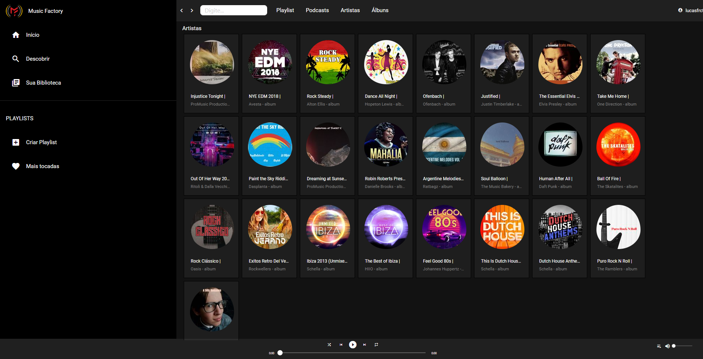

# Music Factory
Music Factory é um aplicativo web para reproducão de músicas mp3 em formado de cartucheira de audio para rádios e eventos.
Essa aplicação é responsiva de foi testada com os principais navegadores em dispoitivos mobilie.

## Tecnologias:
    Esse player foi desenvolvido em Angular usando Typescript.

## Funcionalidades
    - Player mp3
    - Lista de reprodução
    - Histórico de tempo reproduzido em cada áudio
    - Histórico de tata e hora de repodução
    - Inidcação do áudio que está no ar
    - indicação da reprodução anterior
## Home

