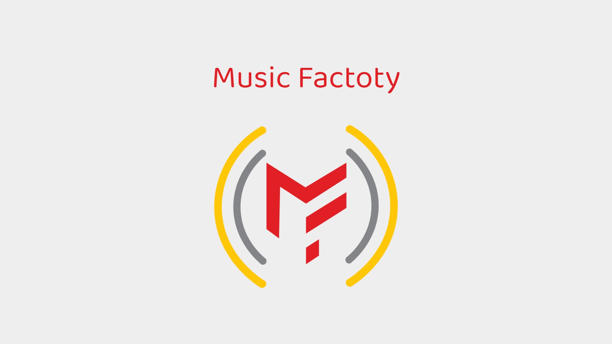
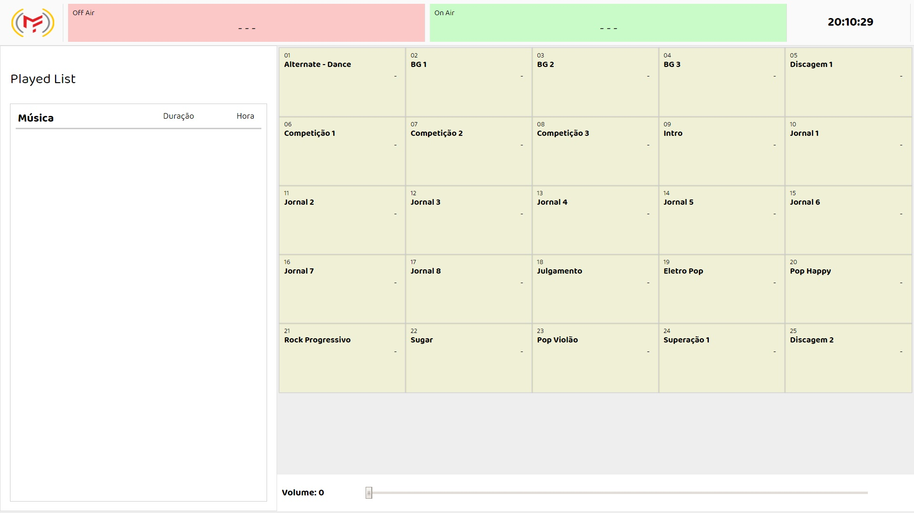

# MusicFactory

This project was generated with [Angular CLI](https://github.com/angular/angular-cli) version 11.2.5.

## Development server

Run `ng serve` for a dev server. Navigate to `http://localhost:4200/`. The app will automatically reload if you change any of the source files.

## Code scaffolding

Run `ng generate component component-name` to generate a new component. You can also use `ng generate directive|pipe|service|class|guard|interface|enum|module`.

## Build

Run `ng build` to build the project. The build artifacts will be stored in the `dist/` directory. Use the `--prod` flag for a production build.

## Running unit tests

Run `ng test` to execute the unit tests via [Karma](https://karma-runner.github.io).

## Running end-to-end tests

Run `ng e2e` to execute the end-to-end tests via [Protractor](http://www.protractortest.org/).

## Further help

To get more help on the Angular CLI use `ng help` or go check out the [Angular CLI Overview and Command Reference](https://angular.io/cli) page.

# Music Factory
Music Factory é um aplicativo web para reproducão de músicas mp3 em formado de cartucheira de audio para rádios e eventos.
Essa aplicação é responsiva de foi testada com os principais navegadores em dispoitivos mobilie.

## Tecnologias:
    Esse player foi desenvolvido em Angular 8 usando Typescript e JS 6.

## Funcionalidades
    - Player mp3
    - Lista de reprodução
    - Histórico de tempo reproduzido em cada áudio
    - Histórico de tata e hora de repodução
    - Inidcação do áudio que está no ar
    - indicação da reprodução anterior

## Home

## Cartuchera

